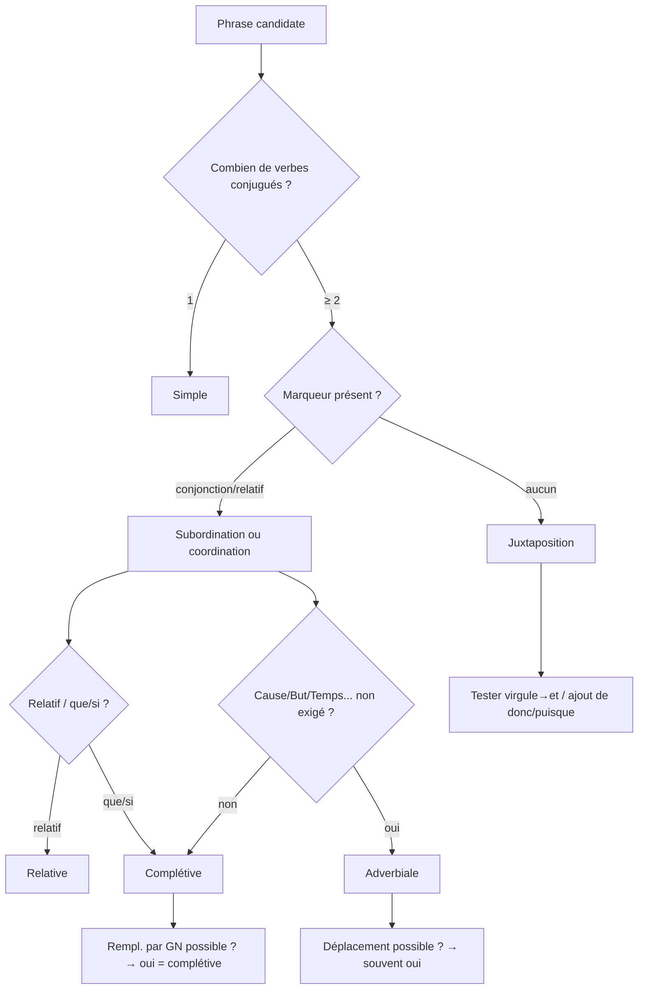
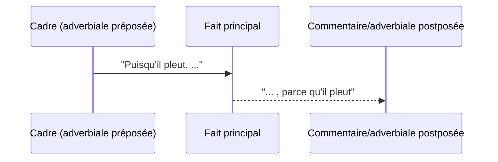

# La phrase complexe en français

**Juxtaposition · Coordination · Subordination**
(*Cours de linguistique appliquée & théorique – version développée, avec définitions, explications, exemples et mises en lumière des cas limites.*)

---

## 1) Rappel : qu’est-ce qu’une phrase complexe ?

Une **phrase complexe** est une unité syntaxique qui contient **au moins deux propositions** (deux prédicats verbaux). Elle se définit à la fois :

* comme **unité de communication** autonome (intonation, ponctuation, sens global),
* et comme **structure hiérarchisée** où des propositions s’assemblent selon trois modes d’organisation : **juxtaposition, coordination, subordination**.

> On parlera de **proposition** pour désigner un groupe organisé autour d’un verbe conjugué (ou d’un équivalent).

**Portée discursive (à ajouter).**
Au-delà de la syntaxe, la phrase complexe est aussi un **dispositif discursif** : un même lien sémantique (cause, concession, but, conséquence) peut être exprimé par **subordination**, **coordination**, **juxtaposition** ou encore par le **lexique** et l’**anaphore** (*à cause de cela, dans ce but*). Autrement dit, il faut distinguer le **sens relationnel** (le concept) du **marquage** (la forme).

---

## 2) Les trois modes d’assemblage

### A. La **juxtaposition**

**Définition.** Suite de propositions **potentiellement indépendantes**, **non liées par un mot de relation**. Le lien est assuré **à l’oral par une pause**, **à l’écrit par la ponctuation** (virgule, point-virgule, deux-points).

**Indices formels**

* Absence de conjonction ou d’adverbe connecteur.
* Ponctuation faible ou moyenne : `, ; :`
* Melodie/rythme : courte pause entre les segments.

**Valeurs sémantiques fréquentes** (selon le contexte)
succession / cause-conséquence implicite / opposition atténuée / explication.

**Exemple pivot (du cours).**

> *Il a plu toute la nuit, les routes sont mouillées.*

* Analyse : deux propositions **juxtaposées** ; la virgule **suggère** une relation causale (**pluie → routes mouillées**) **sans l’encoder**.
* Test : si on remplace `,` par **et**, on passe à la coordination ; si on ajoute **donc** ou **puisque**, on entre dans l’explicitation (coordination ou subordination).

**Transformations utiles**

* Juxtaposition → Coordination :
  *Il a plu toute la nuit **et** les routes sont mouillées.*
* Juxtaposition → Subordination (causale) :
  *Comme/Puisqu’**il a plu** toute la nuit, **les routes sont** mouillées.*
* Juxtaposition → Subordination (consécutive) :
  *Il a **tellement** plu toute la nuit **que** les routes **sont** mouillées.*

**Pièges fréquents**

* Confondre la **valeur interprétée** (cause) avec le **marquage grammatical** (ici, non marqué).
* Abuser de la virgule là où la syntaxe exige un lien marqué (ex. avant une relative introduite par *qui*, pas de virgule si la relative est déterminative).

**Portée textuelle (à ajouter).**
La juxtaposition **n’encode pas** la relation : elle **l’expose**. Le lecteur reconstruit la cohérence par **inférence**. Elle appartient autant à la **micro-syntaxe** qu’à la **macro-structure textuelle** : elle aligne souvent des « tableaux » d’événements dans un **ordre iconique** (chronologique, causal présumé).

---

### B. La **coordination**

**Définition.** Suite de propositions dont **au moins deux** sont liées par une **conjonction de coordination** ou par un **adverbe connecteur**. Aucune des propositions coordonnées **n’est hiérarchiquement dépendante** de l’autre : elles sont **symétriques**.

**Marqueurs prototypiques**

* Conjonctions de coordination : **mais, ou, et, donc, or, ni, car**.
* Connecteurs/adverbes conjonctifs : **puis, ensuite, cependant, néanmoins, en effet, pourtant, ainsi**, etc. (ils ne sont pas toujours de “vraies” conjonctions, mais jouent un lien de **coordination discursive**).

**Exemple pivot (du cours).**

> *Il a plu toute la nuit **et** les routes sont mouillées.*

* Analyse : **et** relie deux propositions d’**égal statut** ; la causalité est **inférée**, pas codée.
* Remarque : avec **car**, on code une explication ; avec **donc**, une conséquence.

**Variantes et effets de sens**

* **mais** (opposition) : *Il a plu toute la nuit, **mais** les routes ne sont pas mouillées.*
* **donc** (conséquence) : *Il a plu toute la nuit, **donc** les routes sont mouillées.*
* **or** (transition argumentative) : *Il a plu toute la nuit, **or** le sol est déjà saturé.*

**Tests**

* Suppression de la conjonction : on retombe sur la juxtaposition → perte du marquage explicite.
* Commutation de la conjonction : modifie l’**orientation argumentative** (et ↔ mais ↔ donc ↔ car).

**Orientation argumentative (à ajouter).**
Selon la conjonction, la coordination **oriente** l’argumentation sans créer de hiérarchie : *et* additionne, *mais* oppose, *donc* conclut, *car* **justifie** rétrospectivement. Le **contenu causal** peut rester implicite (avec *et*) ; la coordination rend le **lien visible** mais laisse au contexte le soin d’en préciser la **nature**.

---

### C. La **subordination**

**Définition.** Assemblage fondé sur un **rapport de dépendance orientée** : une proposition est **subordonnée** (fonction syntaxique à l’intérieur d’une autre) et l’autre est dite **régissante** (ou **matrice**).

> Traditionnellement, on parlait de **principale** vs **subordonnée** ; la grammaire moderne préfère **proposition régissante**/**proposition subordonnée**, voire **verbe-tête** (celui qui gouverne).

**Clarification terminologique (à ajouter).**
Plutôt que « principale », parler de **proposition régissante** ou de **verbe-tête** : dans *Il faut que tu partes*, la matrice n’est **pas autonome** sans la subordonnée. La subordination est une **dépendance orientée** où la subordonnée est **sélectionnée** (mode, type, position) par le verbe-tête.

**Grands types**

1. **Conjonctives complétives** : introduites par **que, si**… → remplissent une **fonction d’argument** (souvent COD) du verbe régissant.

   * *Je **pense** **que** tu as raison.*
   * *Je **me demande si** elle viendra.*
2. **Subordonnées circonstancielles** : temps (**quand, lorsque**), cause (**puisque, comme**), concession (**bien que**), condition (**si**), but (**pour que**), conséquence (**si bien que**), etc.

   * *Puisqu’**il a plu** toute la nuit, **les routes sont** mouillées.*
   * *Bien qu’**il ait plu**, **les routes ne sont pas** mouillées.*
3. **Relatives** : introduites par **qui, que, dont, où**, etc., **ancrées** sur un antécédent nominal.

   * *Les routes **qui** longent la forêt **sont** mouillées.*

**Deux familles à bien séparer (à ajouter).**
Distinguer **complétives (argumentales)** et **adverbiales (circonstancielles)**.
– Les **complétives** **saturent** un argument du verbe (*dire que*, *vouloir que*, *se demander si*).
– Les **adverbiales** **profilent** une relation (temps, cause, but, concession, condition…) **non exigée** par le verbe.
→ Didactiquement : « phrase complexe » au sens strict pour les **complétives** ; **subordination vraie** (dimension textuelle) pour les **adverbiales**.

**Exemples pivots (du cours) & éclairages**

1. *Puisqu’il/Bien qu’il a(t) plu toute la nuit, les routes sont mouillées.*

* Avec **puisque** → **cause** (fait tenu pour acquis).
* Avec **bien que** → **concession** (attente contrariée) et **subjonctif requis** : *Bien qu’**il ait plu**, …* (corriger *a plu* → *ait plu*).
* **Statut** : la subordonnée **modifie** la proposition régissante (*les routes sont mouillées*) en **précisant la relation logique** (cause / concession).

2. *J’attends **que le bus passe***.

* La subordonnée **complète** le verbe **attendre** : **COD** de *attendre*.
* **Mode** : subjonctif fréquent après *attendre que* (valeur de non-réalité/attente).
* **Qui dépend de qui ?**

  * **Dépendance syntaxique** : la subordonnée dépend du verbe régissant (*attendre* **sélectionne** un complément en *que + subjonctif*).
  * **Dépendance sémantique (interprétative)** : l’état d’“attendre” **prend sens** en fonction de l’événement subordonné — d’où l’intuition inverse.
  * Les grammaires contemporaines (ex. **Grande Grammaire du Français**, GGF) parlent plutôt de **verbe-tête** et évitent de figer la notion de “principale”, parfois **trompeuse** quand la matrice n’est pas interprétable sans sa subordonnée.

**Contrôle du mode / contraintes de sélection**

* Beaucoup de verbes **régissants** imposent **indicatif** vs **subjonctif** (*penser que* vs *douter que*), ou exigent **si** plutôt que **que** (*se demander si*). C’est un indice fort de **subordination**.

**Tests de reconnaissance**

* **Déplacement** possible des circonstancielles : *Quand il pleut, je reste / Je reste quand il pleut.*
* **Remplacement** par un **GN** pour les complétives : *J’attends **cela**.*
* **Pronominalisation** de la relative : *Les routes **qui**…* → *Elles…*

**Erreurs fréquentes à éviter**

* Employer l’indicatif après **bien que** (→ **subjonctif**).
* Croire que la “principale” est toujours **autonome** sémantiquement : avec des verbes **recteurs** (dire, vouloir, attendre, falloir…), la **matrice** peut être **syntaxiquement incomplète** sans sa subordonnée.

---

### D. Codage vs inférence

Une conjonction **n’épuise pas** le sens : *parce que* couvre à la fois des **causes phénoméniques** (*la digue a cédé parce qu’il a plu*) et des **motifs d’action** (*je suis resté parce qu’il a plu*). À l’inverse, des marqueurs **non causaux** peuvent **induire** la causalité (*après que…* → antériorité codée, cause inférée). Toujours évaluer la **part de codage** et la **part d’inférence**.

### E. Perspective informationnelle

Les adverbiales permettent un **pilotage informationnel** : en **pré-pose**, elles instaurent un **cadre** (arrière-plan) (*Puisqu’il pleut, …*), en **post-pose**, elles apportent une **justification** ou un **commentaire** après le fait (*…, parce qu’il pleut*). Le placement règle le **focus** (premier plan vs arrière-plan) sans changer le contenu propositionnel.

---

## 3) J vs C vs S — ultra-compact

| P  | J              | C                | S                     |
| -- | -------------- | ---------------- | --------------------- |
| L  | ,;:            | conj             | sub/rel               |
| H  | —              | —                | r→s                   |
| M  | peu            | peu              | dépl.                 |
| T  | “,”→et         | –conj→j          | GN; dépl.             |
| Ex | Pluie, routes. | Pluie et routes. | Puisqu’pluie, routes. |

*P=Propriété · J=Juxtaposition · C=Coordination · S=Subordination · L=Lien · H=Hiérarchie · M=Mobilité · r→s=régissante→subordonnée · conj=conjonction · rel=relatif · GN=groupe nominal · dépl.=déplacement.*


---

## 3 bis) Encadré typologique — paramètres utiles

Pour comparer les manières de lier deux propositions, raisonner en **paramètres** :

* **Degré d’intégration** (parataxe → enchâssement),
* **Compression / désententialisation** (infinitif, gérondif, nominalisation),
* **Explicitness** du lien (zéro → conjonction → lexique spécialisé).
  Ces **continua** expliquent la diversité des formes pour un **même** lien sémantique.

---

## 4) EXO

1. **“Il a plu toute la nuit, les routes sont mouillées.”**

   * **Effet** : sobriété, causalité **sous-entendue** ; style informatif.
   * **Réécriture explicite** : *Il a plu toute la nuit, **donc** les routes sont mouillées* (raisonnement mis en avant).

2. **“Il a plu toute la nuit **et** les routes sont mouillées.”**

   * **Effet** : addition neutre, **symétrie** des faits.
   * **Variante argumentative** : *Il a plu toute la nuit, **car** les routes sont mouillées* (→ **à éviter** : sens inversé ! *car* donne la cause de ce qui précède).

3. **“Puisqu’il / Bien qu’il ait plu toute la nuit, les routes sont mouillées.”**

   * **Cause** vs **Concession** ; **subjonctif** requis après **bien que**.
   * **Choix stylistique** : *puisque* présuppose le fait ; *parce que* le **met au premier plan** (justification en discours).

4. **“J’attends que le bus passe.”**

   * **Complétive** (COD de *attendre*), **subjonctif** fréquent (*passe*).
   * **Point théorique** (GGF) : préférer parler de **verbe-tête** et de **dépendances** plutôt que d’une “principale” au sens naïf.

---

## 5) Methodo

1. **Compter les verbes conjugués** → nombre de propositions.
2. **Repérer les marqueurs** : conjonctions, relatifs, adverbes connecteurs, ponctuation.
3. **Tester** :

   * supprimer/remplacer le lien ;
   * déplacer un segment ;
   * pronominaliser / nominaliser (*cela*).
4. **Attribuer une fonction** à la subordonnée (complément d’argument ? circonstance ? relative ?).
5. **Vérifier le mode/temps** requis (subjonctif après *bien que, pour que, avant que…*).
6. **Estimer la part de codage vs d’inférence** et l’**effet informationnel** du placement (pré-/post-pose des adverbiales). *(ajout)*

---

## 6) Exercices

**A. Classer et justifier**

1. *Le vent forcit, la mer se lève.* → **Juxtaposition** (virgule seule, valeur causale implicite).
2. *Le vent forcit **et** la mer se lève.* → **Coordination** (**et**, symétrie).
3. ***Comme** le vent forcit, la mer se lève.* → **Subordination** (causale).
4. *Je **crois que** tu as raison.* → **Subordination complétive** (COD de *croire*).
5. *Les routes **qui** longent la rivière sont fermées.* → **Relative**.

**B. Transformer**

* À partir de *Il a plu toute la nuit, les routes sont mouillées.*

  1. Coordination : *Il a plu toute la nuit **et** les routes sont mouillées.*
  2. Cause : \*\*\*Puisqu’\**il a plu toute la nuit, **les routes sont** mouillées.*
  3. Concession : \*\*\*Bien qu’\**il **ait** plu toute la nuit, **les routes ne sont pas** mouillées.*

**C. Corriger le mode**

* *Bien qu’il **a** plu toute la nuit…* → *Bien qu’il **ait** plu toute la nuit…* (**subjonctif**).

---

## 7) Points de doctrine (GGF & approches modernes)

* La notion traditionnelle de **“phrase principale”** peut être **trompeuse** : dans de nombreux cas (complétives), la proposition dite “principale” **n’est pas autonome** sans sa subordonnée (*Il faut **que**…, J’attends **que**…*).
* On privilégie l’analyse en termes de **verbe régissant / verbe-tête** et **dépendances** (sélection du mode, du type de complément, position possible).

---

## 8) erreurs fréquentes

* **Mettre une virgule** entre deux propositions reliées par **et** (*\*Il a plu, et les routes…*) : la virgule est en général **inutile** (sauf effets prosodiques).
* Employer **indicatif** après **bien que** / **avant que** (→ subjonctif).
* Prendre une **juxtaposition** pour une **coordination** faute d’avoir vu qu’il **n’y a pas** de mot de liaison.
* Supposer que la **cause** est toujours **marquée** : beaucoup de causalités sont **inférées** (juxtaposition, et).

---

## 9) recap

* **Juxtaposition** : lien **non marqué** (ponctuation), interprétation contextuelle.
* **Coordination** : **symétrie** entre propositions, lien **explicite**.
* **Subordination** : **hiérarchie** et **fonction** de la subordonnée (argument/circonstance/relative), souvent avec **contraintes de mode**.

---

### Annexes

**Causale** : *Puisqu’il pleut, nous restons.* / *Comme il était tard, on est parti.*
**Concessive** : *Bien qu’il **soit** tard, nous sortons.*
**Conditionnelle** : *Si tu viens, j’apporte le dessert.*
**Finale (but)** : *Je chuchote **pour que** tu **entendes** mieux.*
**Consécutive** : *Il a tellement plu **que** la rivière **a débordé**.*
**Temporelle** : *Lorsque le bus **arrivera**, nous **partirons**.*
**Relative** : *La route **que** tu prends **est** barrée.*

**Même relation, formes variées (ajouts)**
– **Cause** : *Parce qu’il a neigé, le toit a cédé* (subordination codée) / *Il a neigé **et** le toit a cédé* (coordination, cause inférée) / *Il a neigé. **À cause de cela**, le toit a cédé* (juxtaposition + anaphore) / *Après qu’il a neigé, le toit a cédé* (temps → cause inférée).
– **But / motif** : *Je pars tôt **pour** éviter l’affluence* (préposition générique) vs *… **dans le but de / avec l’intention de*** (sur-codage : finalité raisonnée).

---
### Outils Memo

## 1) Carte mentale des liens

graph LR
  A[Relations sémantiques] --> B(Cause)
  A --> C(Concession)
  A --> D(But)
  A --> E(Conséquence)
  A --> F(Temps/Condition)

  subgraph Moyens d'expression
    M1[Subordination]:::s
    M2[Coordination]:::c
    M3[Juxtaposition]:::j
    M4[Lexique + anaphore]:::l
  end

  B --- M1
  B --- M2
  B --- M3
  B --- M4
  C --- M1
  D --- M1
  E --- M1
  F --- M1

  classDef s stroke-dasharray: 3 2;
  classDef c stroke-width:2px;
  classDef j stroke:#999,stroke-dasharray: 1 3;
  classDef l stroke:#666,stroke-dasharray: 5 2;


---

## 2) Arbre décisionnel d’analyse



---

## 3) Continuum « codage ↔ inférence »


[Zero marquage] -- Juxtaposition -- Coordination (et/or/mais)
   \__ inférence max                         |-- "donc/car" => codage partiel
--------------------------------------------+--------------------------------
           Subordination (parce que, bien que, si, quand)
           \__ codage explicite de la relation


---

## 4) Effet du placement des adverbiales



> **Lecture rapide** : préposée → met en **arrière-plan** le motif et cadre l’info ; postposée → donne la **justification** après le fait.

---

## 5) Matrice d’équivalences (même relation, formes variées)

```mermaid
graph TB
  CAUSE[Relation : CAUSE]
  CAUSE --> S1[Subordination : "Parce qu'il a neigé, le toit a cédé."]
  CAUSE --> C1[Coordination : "Il a neigé et le toit a cédé."]
  CAUSE --> J1[Juxtaposition : "Il a neigé. À cause de cela, le toit a cédé."]
  CAUSE --> T1[Temps→Cause inférée : "Après qu'il a neigé, le toit a cédé."]
```

---

## 6) Paramètres (typologie) en un coup d’œil

```
INTÉGRATION     : Parataxe → Adjointe → Chaînage → Enchâssement
COMPRESSION     : Proposition finie → Infinitif → Gérondif → Nominalisation
EXPLICITNESS    : Zéro → Conjonction générique → Conjonction spécialisée → Lexique (motif, intention…)
```

---

## 7) Arbres syntaxiques (constituants) – ASCII propres

**a) Causale préposée**

```
CP
├─ SP[Conj: Puisque]
│  └─ P[il a plu toute la nuit]
└─ P'[les routes sont mouillées]
```

**b) Complétive objet**

```
P
├─ GV[attends]
└─ CP[que]
   └─ P[le bus passe]
```

**c) Relative déterminative**

```
GN
├─ N[les routes]
└─ PR[qui]
   └─ P[longent la forêt]
```

---

## 8) Mini-arbres de dépendances (schéma têtes → dépendants)

**a) *Parce qu’il a plu, les routes sont mouillées***

```
sont ──► routes (sujet)
sont ──► mouillées (attribut)
sont ──► a_plu (modif. cause)
a_plu ──► parce_que (subordonnant)
a_plu ──► il (sujet)
```

**b) *J’attends que le bus passe***

```
attends ──► je (sujet)
attends ──► passe (complétive)
passe  ──► que (subordonnant)
passe  ──► bus (sujet)
bus    ──► le (déterminant)
```

---

## 9) Gabarits « flashcards

9) Gabarits « flashcards »

[Détecter]

Compter les verbes.
Chercher un marqueur (et/mais/donc ; que/si ; relatif).
Pas de marqueur ? ⇒ juxtaposition (valeur inférée).

[Classer]

Relatif → relative
que/si requis par le verbe → complétive (phrase complexe).
Cause/But/Temps non exigé par le verbe → adverbiale.

[Tester]

Déplacement (adverbiales) ; remplacement par GN (complétives).
Commutation des conjonctions (et/mais/donc/car) = orientation.
Mode : bien que → subjonctif ; avant que → subjonctif.

---

## 10) recap

``
graph LR
  J[Juxtaposition]:::j -- ponctuation --> R[Relation inférée]
  C[Coordination]:::c -- conj./connecteur --> R
  S[Subordination]:::s -- subordonnant --> R

  classDef j stroke:#999,stroke-dasharray: 2 4;
  classDef c stroke-width:2px;
  classDef s stroke:#333;
```

---
