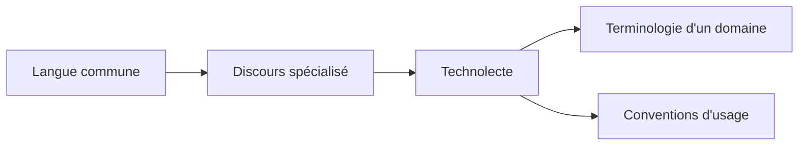
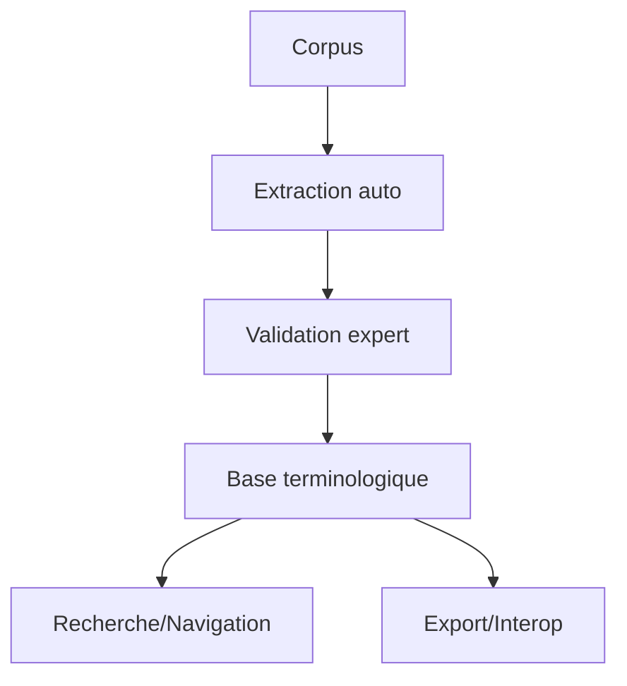

# Terminologie linguistique — Cours (M1 Sciences du langage)

> **Enseignant·e** : Pr. Franck Neveu — Sorbonne Université, Faculté des Lettres, UFR de Langue française
> **Cours magistral** : *Le vocabulaire du discours linguistique*
> **Contact** : [franck.neveu@sorbonne-universite.fr](mailto:franck.neveu@sorbonne-universite.fr)

---

## Objectifs du cours

* Donner une **vision claire et structurée** de la terminologie linguistique (définitions, usages, enjeux).
* Distinguer **terminologie, métalangue, technolecte**, et situer **terminographie** et **terminotique**.
* Maîtriser des **critères** (stabilité, univocité, adéquation…) et des **fonctions** (évocatoire, descriptive, évaluative) des termes.
* Outiller l’étudiant·e pour **lire, traduire, produire** du discours scientifique en linguistique.

---

## Plan rapide

1. Terminologie, termes, technolectes
2. Métalangue et pluralité des métalangues
3. Terminographie & terminotique (chaîne concept → données)
4. Fonctions & principes des termes (tableaux + exemples)
5. Repères historiques (traditions → modernité → aujourd’hui)

---

## 1) Terminologie, termes & technolectes

### 1.1 Termes & terminologie — définitions opérationnelles

| Notion       | Définition               |
| ------------ | ------------------------ |
| Terme        | Mot/syntagme spécialisé. |
| Terminologie | Ensemble des termes.     |
| Discipline   | Étude des dénominations. |

**Extrait (Saussure)**

> « Il n’y a aucun terme définissable et valable **hors d’un point de vue précis**… L’expression simple sera **algébrique** ou ne sera pas. »

**Extrait (Lerat)**

> « Les dénominations techniques sont **dans la langue** (…) mais ce sont des **dénominations de connaissances spécialisées**. »

* **Nuance importante** : un terme peut être **opaque** morphologiquement (ex. *diathèse*), mais reste accepté si stabilisé par l’usage savant.
* **Exemple complémentaire** : *métaphore conceptuelle* (Lakoff & Johnson) → terme complexe, pas transparent mais accepté comme désignation d’un concept partagé.

---

### 1.2 Ce qui fait un « bon » terme (critères utiles)

| Critère      | Exemple                        |
| ------------ | ------------------------------ |
| Stabilité    | *phonème* = sens fixe.         |
| Famille      | *phon-* : phonème, phonétique. |
| Collocations | *analyse syntaxique*.          |
| Transparence | *pronom réfléchi*.             |
| Univocité    | 1 terme = 1 notion.            |

**Mini-exemple** : *phonème* (défini, stable, famille *phon-*, cooccurrences techniques, univoque dans son cadre).

* **Stabilité** : un terme doit éviter les glissements. Ex. *syntagme* est stable en grammaire structurale, mais polysémique si utilisé en stylistique.
* **Syntagmatique restreinte** : illustrer par *analyse morphologique*, *analyse contrastive*, où « analyse » est un pivot terminologique.
* **Univocité** : rarement absolue → ex. *accent* = (phonétique), (poétique), (sociolinguistique). Ici, on voit une **contrainte épistémologique** : il faut toujours **déclarer le cadre**.

---

### 1.3 Technolecte (langue de spécialité)

* **Définition** : *discours spécialisé* utilisé dans une communauté **technique/scientifique** (non une langue indépendante).
* **Clé** : la **grammaire** reste celle de la langue commune ; la **spécificité** vient du **lexique** (terminologie + tournures convenues).

**Exemple** : le technolecte grammatical (*sujet, complément, conjonction*) :
les mots existent en français courant, mais les **définitions** sont techniques et **stabilisées**.

| Aspect   | Résumé                    |
| -------- | ------------------------- |
| Nature   | Discours spécialisé.      |
| Support  | Langue commune.           |
| Marqueur | Lexique technique.        |
| Ex.      | *sujet, COD* (grammaire). |

* **Manque dans ton cours** : préciser que le technolecte se définit aussi par ses **communautés de pratique** (médecins, juristes, linguistes).
* **Exemple élargi** : un médecin parlant de *bradycardie* (terme technique) s’adresse à un pair ; s’il parle au patient, il dira plutôt *ralentissement du cœur*.
* → Le technolecte fonctionne donc comme **registre endogroupe**.

#### Schéma (mermaid) — où se situe le technolecte ?



---

## 2) Métalangue : parler la langue de la langue

### 2.1 Notion

* **Métalangue** = langue (naturelle ou formelle) **qui décrit** la langue.
* En pratique, **usage technique** de la langue commune (mots ordinaires → sens spécialisés).

**Exemples rapides**

* *cas* (commun) → *cas* grammatical (*casus*)
* *voix* (commun) → *voix active/passive* (technique)
* Logique formelle → métalangage pour la sémantique

* Métalangue **naturelle** : *sujet, verbe, COD*.
* Métalangue **formelle** : ∀x (chien(x) → animal(x)).
* **Problème** : toutes les métalangues ne sont pas compatibles entre elles, d’où le rôle critique de la terminologie.

* **Exemple pratique** : quand Chomsky écrit *deep structure*, il crée une métalangue propre à la générative, non transposable telle quelle en grammaire fonctionnelle.


### 2.2 Terminologie (globale) vs. métalangue (cadre)

| Global           | Local               |
| ---------------- | ------------------- |
| Hétérogène.      | Cohérente.          |
| Synonymies.      | Définitions fixées. |
| Idéal difficile. | Univocité possible. |

**Exemple** (*sujet*)

* Grammaire scolaire : « de qui l’on parle / accord »
* Dépendance : **actant sujet** du prédicat
* Fonctionnelle : sujet **grammatical** vs **sémantique**

---

## 3) Terminographie & terminotique

### 3.1 Terminographie (concept → dénominations)

* Démarche **onomasiologique** : partir du **concept** → recenser **désignations**, **définir**, **normaliser**, **documenter**.
* Produits : **glossaires**, **dictionnaires spécialisés**, **thésaurus**.

| Étape         | Action     |
| ------------- | ---------- |
| Concept       | Définir.   |
| Collecte      | Corpus.    |
| Normalisation | Choisir.   |
| Définition    | Rédiger.   |
| Publication   | Glossaire. |

**Chaîne de travail (mermaid)**

```mermaid
flowchart LR
C[Concepts] --> E[Extraction doc/corpus]
E --> N[Normalisation (choix & variantes)]
N --> D[Définitions + notes d'usage]
D --> P[Publication (glossaire, thésaurus)]
```

**Exemple** : glossaire FR-EN des termes de syntaxe (*syntagme nominal ↔ noun phrase*, *rection ↔ government*…), avec définitions concises.

* Ajouter : la terminographie a aussi une **fonction pédagogique** → elle produit des ouvrages de référence pour étudiants et professionnels.
* Ex. : le *Dictionnaire de linguistique* (Dubois et al., 1973) est un outil terminographique majeur.

* Complément : la terminotique intègre aussi le **traitement automatique multilingue**.
* Ex. : extraction des candidats termes par TF-IDF ou collocations → validation → intégration en base.
* → Ici tu peux relier à ton M1 TAL : c’est exactement le rôle des **pipelines d’extraction de termes**.

### 3.2 Terminotique (outils & données)

* **Informatique** appliquée aux **termes** : bases terminologiques, thésaurus multilingues, extraction automatique, alignement, mises à jour.
* Cas d’école : **extraction de candidats termes** dans un corpus de revues (fréquences, cooccurrences) → validation expert → base.

| Domaine   | Usage                   |
| --------- | ----------------------- |
| Données   | Corpus, bases.          |
| Outils    | Extraction, alignement. |
| Bénéfices | Cohérence, diffusion.   |
| Ex.       | IATE (UE).              |

**Écosystème (mermaid)**



---

## 4) Fonctions & principes des termes

### 4.1 Trois fonctions majeures

| Fonction    | Exemple                |
| ----------- | ---------------------- |
| Évocatoire  | *arbre syntaxique*.    |
| Descriptive | *occlusive bilabiale*. |
| Évaluative  | *barbarisme*.          |

> Bon réflexe scientifique : **privilégier** descriptive, **maîtriser** évocatoire, **expliciter** toute évaluation.

* **Évocatoire** : souvent première étape d’une terminologie → ex. *arbre syntaxique*.
* **Descriptive** : tend à se développer à mesure que le champ se formalise.
* **Évaluative** : encore présente dans la grammaire scolaire (ex. *faute*, *barbarisme*). → Cela marque la **dimension idéologique** de certaines terminologies.

### 4.2 Principes (idéaux régulateurs)

| Principe          | Règle               |
| ----------------- | ------------------- |
| Économie          | Pas de doublons.    |
| Univocité         | 1 terme ↔ 1 notion. |
| Adéquation        | Clair, précis.      |
| Non-contradiction | Pas d’oppositions.  |

* **Économie vs adéquation** : tension constante.

* *Grammaticalisation* = économique (1 mot), mais pas transparent pour le profane.
* *Passage d’un lexème à un morphème grammatical* = adéquat mais peu économique.
* **Non-contradiction** : compléter avec un exemple : si *morphème* est défini comme « plus petite unité significative », alors on ne peut pas y inclure le *phonème*, sinon contradiction.


---

## 5) Diversité & traduction terminologiques

### 5.1 Pièges fréquents (FR ↔ EN)

| EN            | FR           |
| ------------- | ------------ |
| tense         | temps        |
| mood          | mode         |
| agreement     | accord       |
| dummy subject | it explétif  |
| small clause  | petite prop. |

> Traduire = **comparer des systèmes notionnels**, pas des « listes de mots ».
> Accepter **emprunts** quand l’équivalent est introuvable ou opaque.

* Insister : la traduction terminologique doit souvent être **commentée** (glose ou note).
* Ex. *Tense* (anglais) ↔ *temps* (français) : préciser dans une note que *tense* n’inclut pas l’aspect.
* **Astuce pratique pour étudiants** : toujours vérifier dans un dictionnaire terminologique bilingue spécialisé, jamais dans un dictionnaire général.

---

## 6) Repères historiques

| Époque       | Termes             |
| ------------ | ------------------ |
| Antiquité    | nom, cas, mode.    |
| XIXe         | ablaut, isolante.  |
| XXe          | phonème, syntagme. |
| Contemporain | corpus, embedding. |

* Antiquité → visée normative.
* XIXe → visée comparative et évolutionniste.
* XXe → visée structurale et systémique.
* XXIe → visée computationnelle et multimodale (apparition de termes comme *embedding*, *treebank*, *annotation*).


---

## Fiches express (notions clés)

### Métalangue

* **Rôle** : décrire la langue.
* **Formes** : naturelle (FR spécialisé), **formelle** (logique, calcul).
* **Alerte** : un même mot peut changer de **statut** (commun → terme).

### Technolecte

* **Rôle** : registre spécialisé **dans** une langue.
* **Marqueur** : **terminologie** + routines discursives.
* **Alerte** : pas un sous-système de grammaire.

### Terminographie

* **Rôle** : **collecter/définir**/publier des termes.
* **Démarche** : **concept → dénominations** (onomasiologie).
* **Produits** : glossaires, thésaurus, dictionnaires.

### Terminotique

* **Rôle** : **outiller** (bases, extraction, interop).
* **Bénéfices** : cohérence, mise à jour, multilinguisme.

---

## Études de cas (mini-applications)

1. **Normaliser deux quasi-synonymes**

   * *structure profonde* vs *structure sous-jacente* → **choisir** 1 libellé, définir, lier l’autre comme **synonyme contrôlé**.

2. **Étiqueter une notion nouvelle**

   * Notion : « passage lexical → grammatical » → *grammaticalisation* (adéquation + descriptif, validé par l’usage scientifique).

3. **Traduire un passage**

   * EN : *The clause displays tense and mood distinctions…*
   * FR : *La proposition présente des distinctions de temps et de mode…*
   * **Note traducteur** : préciser le **cadre** (tense ≠ aspect), éviter amalgame.

---

## Annexes visuelles

### A) Carte conceptuelle (mermaid)

```mermaid
graph TD
T[Terminologie (nomenclature)] --- TG[Terminographie]
T --- TT[Terminotique]
T --- M[Metalangues (multiples)]
M --- M1[Cadre A]
M --- M2[Cadre B]
T --- X[Technolectes (discours spécialisés)]
```

### B) Cycle de vie d’un terme (mermaid)

```mermaid
flowchart LR
I[Besoin conceptuel] --> C[Création / Emprunt]
C --> V[Définition/Validation]
V --> U[Usages & Cooccurrences]
U --> R[Révision/Normalisation]
R --> D[Diffusion (glossaires/bases)]
D --> I
```

---

## Conclusion

* La terminologie linguistique est **le langage de la linguistique** : elle **régule** les notions et **délimite** les domaines.
* Les **fonctions** (évocatoire, descriptive, évaluative) et **principes** (économie, univocité, adéquation, non-contradiction) guident l’**élaboration** de bons termes.
* La **pluralité** des métalangues est **une richesse** (mais exige rigueur).
* Terminographie et terminotique offrent une **méthode** et des **outils** pour **stabiliser**, **documenter** et **partager** les vocabulaires.

> **À retenir** : maîtriser les **termes**, c’est maîtriser les **concepts** — c’est aussi développer le **regard critique** nécessaire pour lire, écrire et traduire en sciences du langage.

---

## Brèves citations (pour mémoire)

* **F. de Saussure** : « *Il n’y a pas du tout d’expression simple pour les choses à distinguer primairement en linguistique ; l’expression simple sera **algébrique** ou ne sera pas.* »
* **P. Lerat** : « *Les dénominations techniques sont dans la langue (…) mais ce sont des dénominations de **connaissances spécialisées***. »

---

## Exercices rapides (auto-évaluation)

1. Donnez **deux cooccurrences** typiques de *syntagme* et expliquez la **syntagmatique restreinte**.
2. Proposez un **terme plus adéquat** que *diathèse* pour un public non spécialiste : justifiez.
3. Traduisez *tense* et *aspect* en français dans un court paragraphe **sans** les confondre ; ajoutez une **note** d’explication.

---
